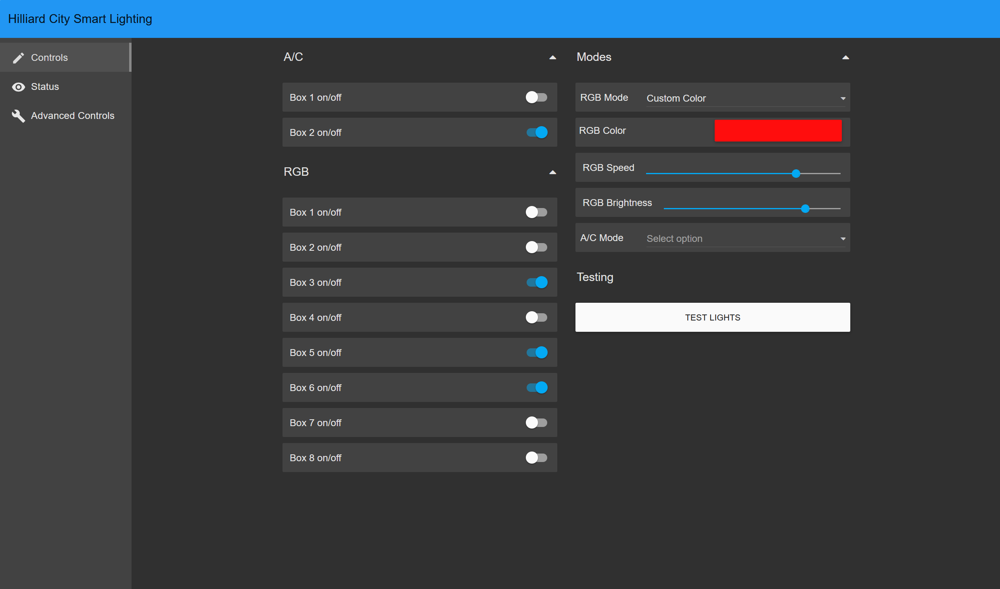
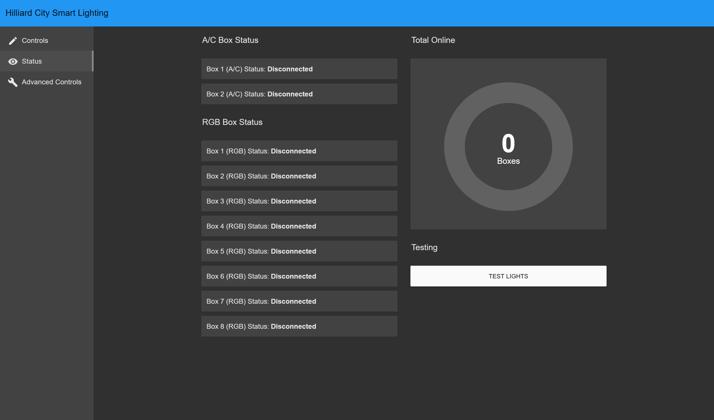
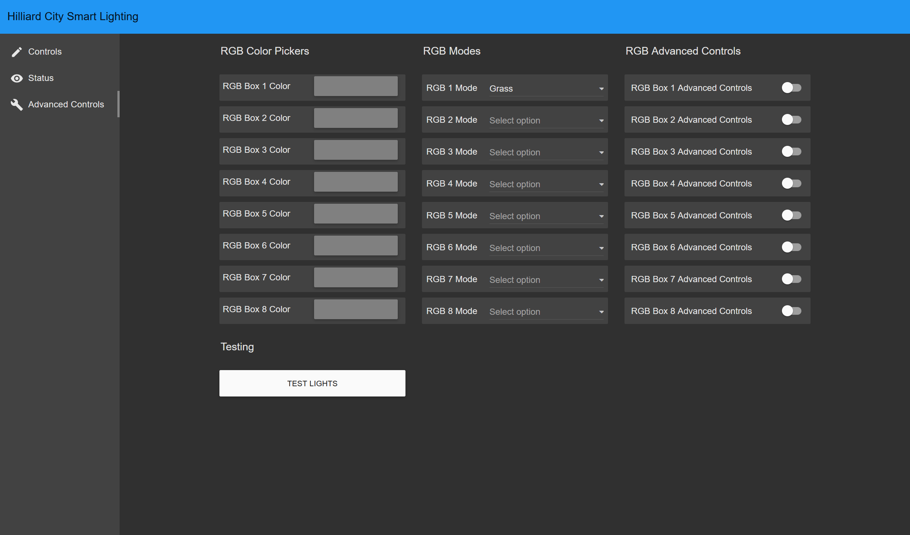

# Hilliard Smart Lighting 
   
## Rasperry PI IP address:
192.168.60.6
## MQTT Usernames and Passwords
### RGB boxes:
n = the number of the box   
Username: RGBn  
Password: HilliardRGB#n
### AC boxes:
Username: ACn  
Password: HilliardAC#n
### Node-RED Broker
Username: Node-RED  
Password: HilliardNode-RED
### Music Processing
Username: MusicBox  
Password: HilliardMusicBox

## Other Usernames and Passwords
### Node-RED Admin Account
Username: intern  
Password: Nut-3nact-D3pict!
### Node-RED UI/User Account
Username: Hilliard  
Password: Sm3lls-Lik3-Sad!

# System Explanation  
Written here is a brief explanation of the flow of the system, followed by more in depth explanations of each individual part of the system.
The system works in 4 major steps:
1. Audio is played on a computer with a pyapp installed to run the music processing. The app reads the system audio and runs a fast fourier transform to seperate the audio into frequencies. The app can then analyze different frequency ranges (bass, treble, and mid) and send out a trigger when they cross a certain threshold (80%, for example).
2. The trigger signal is sent to the MQTT broker, and is redirected to Node-RED, which runs the user interface for lighting control
3. A lighting control signal determined by configuration in the user interface is sent to the broker by Node-RED, and is redirected to the individual lighting boxes.
4. The individual boxes receive their instructions and flash accordingly
## Music Processing
## MQTT
MQTT is the protocol used for the sending of control signals in the reactive lighting system.
### Topics
The different parts of the system are organized into various topics:
| **/lights** | **/lights/RGB** | **/lights/RGB/boxn** | **/lights/RGB/boxn/connection** | **/lights/RGB/brightness** | **/lights/RGB/speed** |
| :---------: | :-------------: | :------------------: | :-----------------------------: | :------------------------: | :-------------------: |
| Where trigger signals from the music processing are sent | An organizational topic | Where the light controls for each individual RGB box (of number n) are sent | Where connection and disconnection messages from each individual RGB box (of number n) are sent | Where brightness controls for RGB boxes are sent | Where speed controls for RGB boxes are sent |
|             | **/lights/AC**  | **/lights/AC/boxn**  | **/lights/AC/boxn/connection**  |                            |                       |
|             | An organizational topic | Where the light controls for each individual AC box (of number n) are sent | where connection and disconnection messages from each individual AC box (of number n) are sent | | |

### Broker
The MQTT broker is run by Mosquitto on a Raspberry PI 
### Node-RED
Node-RED provides configuration of the lights. It runs the user interface, which is hosted by a Raspberry PI alongside the code itself. The code menu can be accessed by entering the ip of the Raspberry PI alongside the 1880 port into the search bar: "(IP address):1880". The UI can be accessed by typing in the same address alongside "/ui": "(IP address):1880/ui"  
  
  
  
  

#### Code Explanation
##### Overview
The Node-RED code works by receiving some input signal from the MQTT broker, sequentially checking all of the settings configured in the UI, and outputting the appropriate signal to send to the boxes. 
##### User Interface
The UI is built using the UIBUILDER Node-RED addon. Through these nodes the different options in the UI are configured. This includes the on/off toggles for all the boxes, the advanced mode toggles for the RGB boxes, the HSV color pickers, the mode selectors for all the boxes, the speed and brightness sliders for the RGB boxes, the test lights buttons, and the total boxes online display.
##### RGB 
- The bulk of the RGB code is checking the settings to see what should be sent to the different boxes. It works in eight phases to check for all of the settings:
  1. The code receives a trigger from an MQTT node (the contents of the signal do not matter)
  2. The code sets a variable "time" to the current UNIX time
  3. The code sets a "delayTime" variable to the sum of "time," and a "delay" variable. It then sets the message payload to a string of "mode " + delayTime.
  4. The message is sent to eight different switches (for eight different boxes), all of which check if their assigned box is turned on. 
  5. The message is sent through a switch which checks if advanced mode is turned on for the assigned box. It then sends the messages to either the regular mode, or advanced mode switches.
  6. Both regular and advanced mode switches check if the mode is set to custom. They then send to either the mode changer, or the custom color changer for their respective complexity.
  7. Both changers will change the "mode" part of the message payload into the mode set in the UI. The color changer will send an HSV value, and the mode will send a value from 1-5. If this is the advanced mode, it will be specific to that box. If it is regular mode, it will be the generalized mode.
  8. The resulting messages payload is sent to an MQTT node which publishes to the proper topic for their respective box.
- The RGB speed and brightness sliders both send the result directly onto their respective topics, which are read by the RGB boxes.
- The RGB connection works by setting the connection status when a given box sends a connection or disconnection message. 
##### AC
- The AC code is far simpler than the RGB code, because it does not have advanced controls to control the individual boxes. It works in five phases instead of eight.
  1. The code receives a trigger from an MQTT node (the contents of the signal do not matter)
  2. The trigger is sent to two different switches (one for each box), each of which checks if its assigned box is on
  3. The trigger is sent through a change node, and is changed into the number for the mode set in the UI
  4. The message is sent through a delay node, which delays it so that it will be in sync with the RGB boxes
  5. The message is sent to an MQTT node which publishes to the proper topic for its assigned box
- AC connection status works in the same way as RGB connection status
##### Broker
- The connection display works by giving each box a number variable for its connection. If it is connected, then it is a one, and if it is not connected, then it is a 0. All these variable are summed and displayed in a gauge in the user interface
- Test lights buttons work by using an MQTT node to send a signal to the same topic the music processing code sends signals on.
  
#### List of Utilities
- Controls
  - A/C
    - On/off control for A/C boxes
  - Modes
    - RGB Mode
      - Fire
      - Grass
      - Ocean
      - Rainbow
      - Christmas
      - Custom
    - RGB Color
      - A color picker, used alongside the "Custom" RGB mode to allow for the user to pick a custom color
    - RGB Speed
      - Used to choose the speed at which the RGB pulses travel
    - RGB Brightness
      - Used to choose the brightness of the RGB LEDs
    - A/C Mode
      - Twinkle
      - Flash
  - RGB
    - On/off control of RGB boxes
  - Testing
    - Has a button to send a test signal to the lights
- Status
  - A/C Box Status
    - Shows the connection status of all A/C boxes
  - RGB Box Status
    - Shows the connection status of all RGB boxes
  - Total Online
    - Has a dial that shows the amount of boxes that are online
  - Testing
    - Has a button to send a test signal to the lights
- Advanced Controls
  - RGB Color Pickers
    - HSV color pickers for each individual box
  - RGB Modes
    - Mode selectors for each individual box
  - RGB Advanced Controls
    - Toggles to turn on or off advanced controls for each individual box
  - Testing
    - Has a button to send a test signal to the lights
  
## RGB Lighting Control Boxes  
The RGB lighting control boxes (RGB boxes) are stored inside waterproof boxes, and comprised of one ESP32 microcontroller to run the code, a 5V power supply to power the ESP32, and an RGB connection cable.  
  
  

### ESP32 Code explanation

`setup()`
- Checks to see what protocol the lights follow (RGB or GRB)
- Calculates the center and end points (collision distances) of each pulse
- Sets all the LEDs to black
- Runs `connectToWifi()`
- Sets up the MQTT connection
- Syncs up the ESP's internal clock with time from pool.ntp.org.

`loop()` 
- Tries to reconnect to the server if the connection is lost
- Loops through mqtt_client_loop()
- Runs through `processDelays()` to push through the backlog
- Checks to see if the LEDs need to be updated based on the system clock.

`updateAnimations() `
- Runs the pulses, pushing the lit LED outwards until the collision distance

`drawPatterns()`
- Defines what each of the `colorModes` do (how they fade/change over the strip)

`spawnPulse()`
- Loops through all of `pulsePositions[]` and sets those that are equal to -1 (inactive) to the `targetColor`

`setLedSafe()` 
- Sets LEDs, but only when they actually exist, preventing errors

`Get_Epoch_Time` 
- Requests the current time from the internet to the second

`mqttCallback()` 
- Handles the incoming messages, and adds them to the backlog with their timestamp

`handleModeMessage()` 
- Adds triggers and delays to the backlog arrays in indexes 0-4, overwriting the beginning of the arrays if it runs out of space

`processDelays()`
- Loops though all 5 elements of the `triggerBacklog` (the array holding the modes for signals), skipping elements that are equal to -1 (empty)
- Checks the `delayBacklog` (the array holding the time of execution for signals) of elements that are not equal to -1 with `currentMillis` (the current time), triggering the lights if the difference of their last 3 digits is less than the threshold (100), and removing the element from the backlog arrays

`handleSpeedMessage()`
- Updates the speed with a scaled number received from MQTT

`handleBrightnessMessage()`
- Updates the brightness

`connectToWifi()`
- Loops until the network is connected, then prints "Connected to the WiFi network"

`connectToMQTTBroker()`
- Loops until the broker is connected
- Sets the "death message" to "Disconnected"
- Subscribes to topics 
- Publishes the "Connected" message

## A/C Lighting Control Boxes
The A/C lighting control boxes (A/C boxes) are designed to have six outlets to connect to one large Christmas tree. They are comprised of one ESP8266 microcontroller, three programmable A/C PWM dimmers, one 5V power supply, and six outlets. The ESP8266 controls the three dimmers, each of which outputs the controlled power to two outlets.  

 

### ESP8266 Code Explanation

`setup()`
- Initializes three `dimmerLamp` objects, each of which corresponds to a physical dimmer
- Runs `connectToWifi()`
- Sets up the MQTT connection over three functions

`connectToWifi()` 
- Loops until the network is connected, then prints "Connected to the WiFi network".

`connectToMQTTBroker()` 
- Loops until the broker is connected
- Sets the "death message" to "Disconnected"
- Subscribes to topics 
- Publishes the "Connected" message

`mqttCallback()` 
- Handles the incoming messages, and activates the proper mode function based on the number sent 

`mode1()`
- Rapidly raises the brightness to 100 then lowers it to the variable `twinkleMap` (set to 55), making the lights "twinkle."

`mode2()` 
- Rapidly raises the brightness to 100 then lowers it to the variable `flashMap` (set to 30), making the lights "flash."

`loop()` 
- Tries to reconnect to the server if the connection is lost
- Loops through `mqtt_client_loop()`

